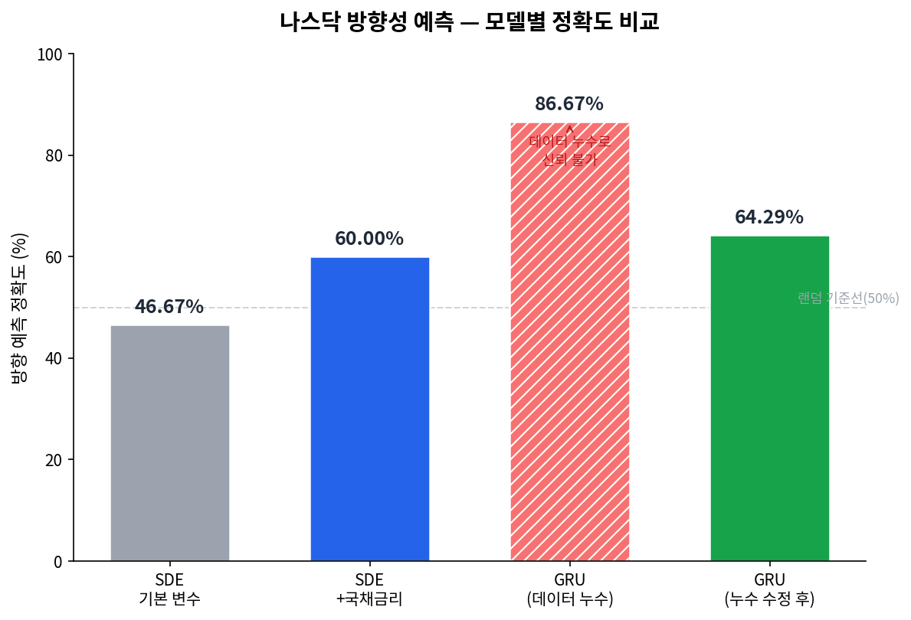

# 나스닥 주가 방향성 예측 — 확률미분방정식(SDE), GRU 두 가지 방식으로

> 정확도 86%라는 결과를 그대로 믿지 않고 원인을 추적해, 데이터 누수를 잡아내고 신뢰할 수 있는 64%로 재조정한 프로젝트

`시계열` `금융데이터` `SDE` `GRU` `Data Leakage`

---

## Overview

| 항목 | 내용 |
| --- | --- |
| 기간 | 2025.09 – 2025.12 |
| 역할 | 데이터 전처리 및 SDE 모델링 담당 |
| 팀 구성 | 정진호, 김형윤, 이우경 (경희대 응용수학과 독립심화학습) |
| 사용 기술 | Python, Pandas, NumPy, PyTorch, SDE(Score-based Diffusion), GRU |

---

## 문제 정의

금융시장은 거시경제지표·유동성·투자심리가 복합적으로 작용해 비선형적으로 움직이기 때문에, ARIMA·GARCH 같은 전통 통계 모델만으로는 방향성을 정확히 예측하기 어렵습니다.

이 프로젝트는 **2014~2024년 10년간의 나스닥 지수 데이터**를 바탕으로, 서로 완전히 다른 두 접근(확률적 생성 모델 vs 순환신경망)을 비교해 어떤 방식이 단기 방향성 예측에 더 적합한지 검증하는 것을 목표로 했습니다.

---

## 접근 방법

**데이터**
- 나스닥 지수(시가/거래량/변동률), 달러인덱스(DXY), 미국 국채금리 — 일별 시계열
- 결측치 제거 후 4가지 일간 변화율·차분 변수(지수 시가 수익률, 거래량 변화율, 변동률 지표, 국채금리 변화분)로 피처 구성, 표준화(평균 0, 분산 1) 적용
- 시간순으로 분할(마지막 30일을 테스트 구간) — 랜덤 분할이 아닌 시계열 특성을 고려한 검증 설계

**모델 1 — SDE (확률미분방정식 기반 점수추정 모델)**
- 입력 4차원(지수 시가 수익률, 거래량 변화율, 변동률 지표, 국채금리 변화분) → Softplus MLP(은닉층 32) → 확산/역확산 단계로 확률 구조 학습
- 손실 함수는 Gauss–Hermite 수치적분으로 확산 과정의 밀도 변화를 근사
- 학습된 분포에서 모의 경로를 다수 생성해 상승 확률 50% 기준으로 방향 예측
- Adam(lr=0.001, weight decay=1e-4), gradient clipping, Early Stopping(patience 100 epoch)

**모델 2 — GRU (순환신경망)**
- 시가/거래량/변동률/국채금리 4개 피처를 20일 시퀀스로 구성
- 2층 GRU(은닉 64) + Dropout + FC layer, 다음날 시가 변화율 예측
- Adam(lr=0.001, weight decay 적용), gradient clipping, Early Stopping(patience 50 epoch)

> 달러인덱스는 초기 실험 변수로 포함해 테스트했으나, 성능 개선이 거의 없으면서 연산 부담만 늘어 최종 파이프라인에서는 제외하고 4차원(국채금리 포함)으로 진행했습니다.

> 📄 하이퍼파라미터·수식 등 더 상세한 내용은 [`docs/technical-report.md`](docs/technical-report.md) 참고

두 모델 모두 Adam 최적화, gradient clipping, Early Stopping을 동일하게 적용해 공정하게 비교했습니다.

---

## 주요 의사결정 & 트러블슈팅

### 1) 피처 선택 — 국채금리 vs 달러인덱스
SDE 모델에 기본 변수만 썼을 때 정확도는 46.67%에 그쳤습니다. 국채금리를 추가하자 **60.00%로 13.33%p 개선**됐지만, 달러인덱스를 추가했을 때는 개선 효과가 거의 없었습니다. 이를 통해 "환율보다 금리·채권 요인이 단기 지수 등락에 더 직접적인 영향을 준다"는 인사이트를 얻었고, 성능 개선도 없이 연산 부담만 늘리는 달러인덱스는 제외해 최종 파이프라인은 4차원(국채금리 포함)으로 확정했습니다.

### 2) GRU 데이터 누수(Data Leakage) 발견 및 수정
GRU 초기 실험에서 정확도 86%라는, 금융 시계열 예측 치고는 비정상적으로 높은 결과가 나왔습니다. 좋은 결과라고 그냥 받아들이지 않고, 왜 이렇게 높은지 의심하고 파고들었습니다.

원인을 추적한 결과:
- 정규화 통계량을 전체 데이터 기준으로 계산해 테스트 구간 정보가 간접적으로 학습에 유입됨
- 시퀀스 생성 과정에서 미래 값이 한 단계씩 섞여 들어가는 구조적 오류 존재

정규화 기준을 "테스트 구간 이전 훈련 데이터"로 제한하고, 시퀀스 생성 로직을 미래 정보가 전혀 유입되지 않도록 전면 재구성했습니다. 수정 후 정확도는 **64.29%로 재조정**됐고, 이 수치가 모델의 실제 예측력을 반영한 값이라고 판단했습니다.

> 참고: 초기(누수) 실험은 7~9월 구간, 수정 후 최종 실험은 11월 구간을 테스트했습니다. 한 학기 동안 프로젝트를 이어가며 모델을 계속 개선·재검증하는 과정에서 테스트 시점 자체가 자연스럽게 뒤로 밀린 것으로, 두 실험을 같은 기간으로 직접 비교하기 위한 것은 아닙니다.

---

## 결과



| 모델 | 조건 | 정확도 |
| --- | --- | --- |
| SDE | 기본 변수 | 46.67% |
| SDE | + 국채금리 | **60.00%** |
| SDE | + 달러인덱스 | 개선 미미 |
| GRU | 초기 (데이터 누수 상태) | 86.67% (신뢰 불가) |
| GRU | 누수 수정 후 | **64.29%** |

> 📊 실제 예측 데이터: [SDE 기본](results/sde_baseline_predictions.csv) · [SDE+국채금리](results/sde_extended_bondyield_predictions.csv) · [GRU 초기(누수)](results/gru_initial_leakage_predictions.csv) · [GRU 최종](results/gru_final_predictions.csv)

두 모델 모두 완전한 예측력을 확보하진 못했지만, 이는 금융 시계열이 갖는 본질적 비정상성(non-stationarity) 때문이라는 점을 확인했습니다. SDE는 이론적으로 확률 구조를 설명하는 데 강점이 있고, GRU는 실용적 단기 예측 성능이 더 안정적이었습니다.

---

## 회고

- 이 프로젝트에서 가장 크게 배운 건 "모델 성능보다 데이터 처리 과정의 건전성이 더 중요하다"는 점이었습니다. 86%라는 좋아 보이는 숫자를 그대로 믿지 않고 원인을 추적한 경험이, 이후 다른 프로젝트에서도 결과를 검증하는 습관으로 이어졌습니다.
- 아쉬운 점: 단순 등락만 확인한 점이 아쉽습니다.
- 다음에 해보고 싶은 것: 더 다양한 feature로 변화를 확인하고, 정확한 값을 예측

---

## 프로젝트 구조

```
nasdaq-direction-prediction-sde-gru/
├── README.md
├── requirements.txt
├── docs/
│   └── technical-report.md   # 전체 연구 보고서 (방법론, 하이퍼파라미터, 논의)
├── data/                 # 원본/전처리 데이터 (대용량·민감 데이터는 .gitignore)
├── notebooks/            # 탐색적 분석, 실험 노트북
├── src/
│   ├── preprocessing.py  # 결측치 처리, 피처 구성, 표준화
│   ├── sde_model.py      # SDE 기반 점수추정 모델
│   ├── gru_model.py      # GRU 모델
│   └── evaluate.py       # 정확도 평가, 시각화
└── results/              # 실제 예측 결과 CSV
    ├── sde_baseline_predictions.csv
    ├── sde_extended_bondyield_predictions.csv
    ├── gru_initial_leakage_predictions.csv
    └── gru_final_predictions.csv
```

> 코드(`src/`)는 현재 정리 중입니다. 정리되는 대로 순차적으로 업로드할 예정입니다.
